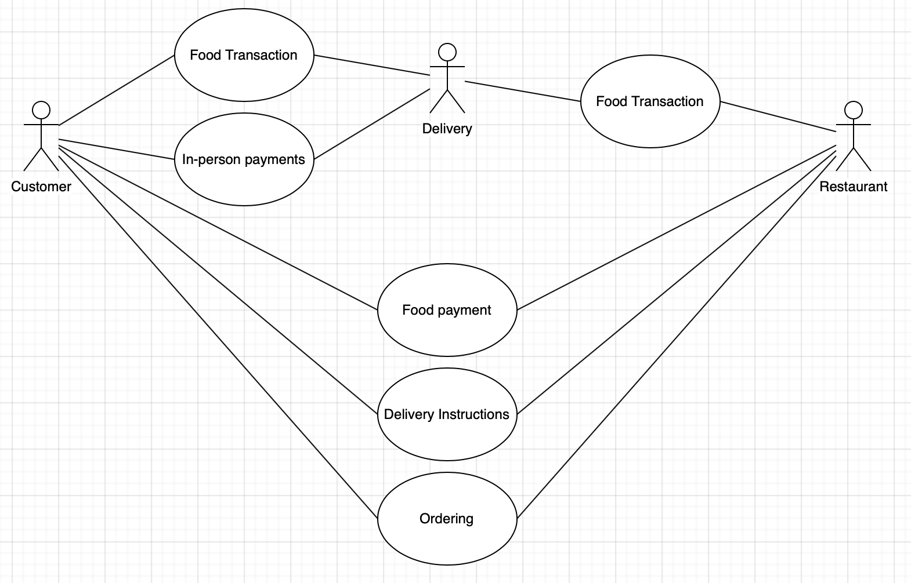
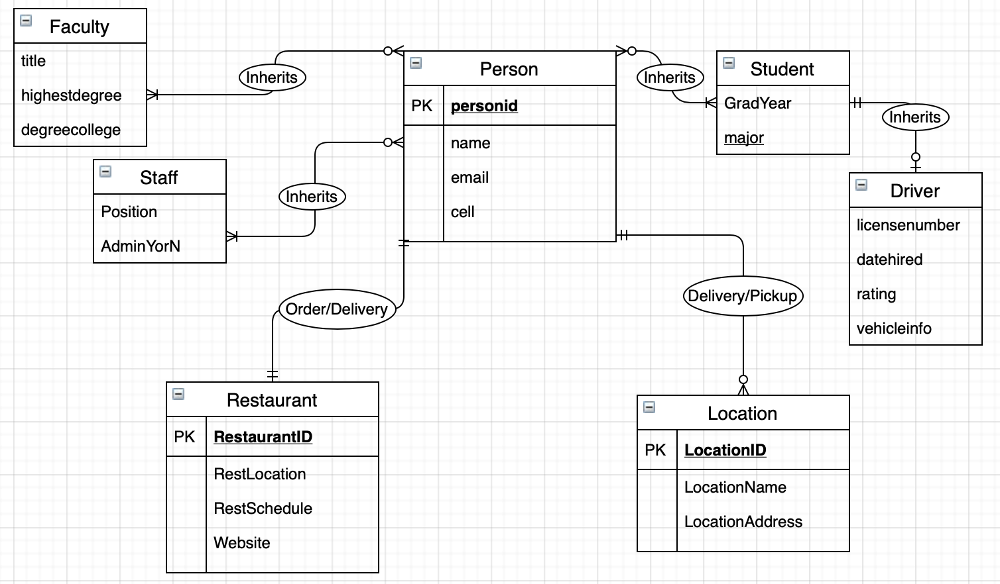

# ITCS3160Project
Semester project for ITCS-3160
 
Brady Ennis
  
Introduction
 
  This project consists of designing a pseudo database system to store data for a food delivery service to provide to students. This project will consist of making an EERD, Building a database in MySQL, loading that database, security or backup recommendations, and a narrated PPT presentation.
  
  
Use Case
 

  
Business Rules
 
- You must be a student, campus faculty, or campus staff.
- There is a $5 flat delivery fee for all orders.
- Drivers must provide necessary information to be accepted as a worker.
- Food providers and restaurants must be approved before being used in this service.
- Eating habits will be recorded to measure the nutrition of campus community members.
  
EERD
 

  
MySQL Queries
  
Trigger
  
Stored Procedure
  
Description of Future Work
 
  The future work to be done would be the whole project aside from creating this first document.
  
MySQL dump
